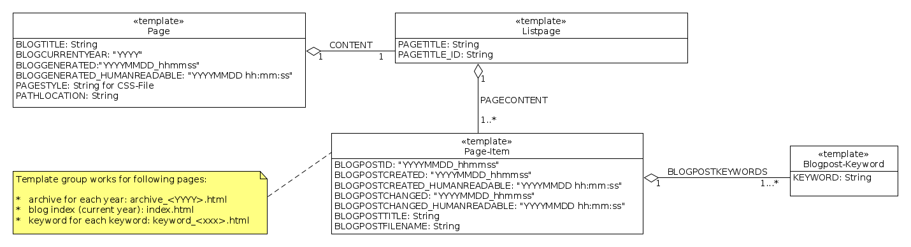

# Templates and Data Structure

## HTML Template Structure

### Overview (List of Years and List of Keywords)


### Blogpost


### Yearly Archive and Keyword Index




## Data Structure


Example log of data structure

```
{'archiveMetaData': {2018: ['20180811_080000.html',
                            '20180810_080000.html',
                            '20180810_070000.html',
                            '20180806_060000.html',
                            '20180729_084500.html',
                            '20180517_080000.html',
                            '20180507_130000.html']},
 'blogPostList': ['20180811_080000.html',
                  '20180810_080000.html',
                  '20180810_070000.html',
                  '20180806_060000.html',
                  '20180729_084500.html',
                  '20180517_080000.html',
                  '20180507_130000.html'],
 'blogPostMetaData': {'20180507_130000.html': {'blogchanged': datetime.datetime(2018, 5, 7, 13, 0),
                                               'blogcreated': datetime.datetime(2018, 5, 7, 13, 0),
                                               'blogkeywords': ['code',
                                                                'pyexcel',
                                                                'python'],
                                               'blogtitle': 'HighlightJS'},
                      '20180517_080000.html': {'blogchanged': datetime.datetime(2018, 5, 17, 8, 0),
                                               'blogcreated': datetime.datetime(2018, 5, 17, 8, 0),
                                               'blogkeywords': ['math',
                                                                'machine_learning'],
                                               'blogtitle': 'MathJax'},
                      '20180729_084500.html': {'blogchanged': datetime.datetime(2018, 8, 15, 21, 0),
                                               'blogcreated': datetime.datetime(2018, 7, 29, 8, 45),
                                               'blogkeywords': ['code',
                                                                'python',
                                                                'mock'],
                                               'blogtitle': 'Mock mit Python3'},
                      '20180806_060000.html': {'blogchanged': datetime.datetime(2018, 8, 6, 6, 0),
                                               'blogcreated': datetime.datetime(2018, 8, 6, 6, 0),
                                               'blogkeywords': ['software_architecture',
                                                                'uncle_bob',
                                                                'clean_code'],
                                               'blogtitle': 'The Principles of '
                                                            'Clean '
                                                            'Architecture by '
                                                            'Uncle Bob Martin'},
                      '20180810_070000.html': {'blogchanged': datetime.datetime(2018, 8, 10, 7, 0),
                                               'blogcreated': datetime.datetime(2018, 8, 10, 7, 0),
                                               'blogkeywords': ['code',
                                                                'python',
                                                                'idiom'],
                                               'blogtitle': 'Transforming Code '
                                                            'into Beautiful, '
                                                            'Idiomatic Python'},
                      '20180810_080000.html': {'blogchanged': datetime.datetime(2018, 8, 12, 17, 0),
                                               'blogcreated': datetime.datetime(2018, 8, 10, 8, 0),
                                               'blogkeywords': ['debian',
                                                                'stretch',
                                                                'system_installation'],
                                               'blogtitle': 'Installation von '
                                                            'Debian GNU/Linux '
                                                            '9.5 (stretch)'},
                      '20180811_080000.html': {'blogchanged': datetime.datetime(2018, 8, 11, 8, 0),
                                               'blogcreated': datetime.datetime(2018, 8, 11, 8, 0),
                                               'blogkeywords': ['debian',
                                                                'gmx_mediacenter',
                                                                'webdav'],
                                               'blogtitle': 'GMX MediaCenter '
                                                            'per WebDAV ins '
                                                            'lokale '
                                                            'Dateisystem '
                                                            'einbinden'}},
 'keywordMetaData': {'clean_code': ['20180806_060000.html'],
                     'code': ['20180810_070000.html',
                              '20180729_084500.html',
                              '20180507_130000.html'],
                     'debian': ['20180811_080000.html', '20180810_080000.html'],
                     'gmx_mediacenter': ['20180811_080000.html'],
                     'idiom': ['20180810_070000.html'],
                     'machine_learning': ['20180517_080000.html'],
                     'math': ['20180517_080000.html'],
                     'mock': ['20180729_084500.html'],
                     'pyexcel': ['20180507_130000.html'],
                     'python': ['20180810_070000.html',
                                '20180729_084500.html',
                                '20180507_130000.html'],
                     'software_architecture': ['20180806_060000.html'],
                     'stretch': ['20180810_080000.html'],
                     'system_installation': ['20180810_080000.html'],
                     'uncle_bob': ['20180806_060000.html'],
                     'webdav': ['20180811_080000.html']},
 'blogTitle': 'techBlog',
 'generatorStarted': datetime.datetime(2018, 8, 19, 19, 3, 9, 226749),
 'blogRootDir': '/home/marco/Scratchbook/python3/bloggenerator/_site',
 'projectBlogpostDir': '/home/marco/Scratchbook/python3/bloggenerator/content/blog',
 'projectContentDir': '/home/marco/Scratchbook/python3/bloggenerator/content',
 'projectRootDir': '/home/marco/Scratchbook/python3/bloggenerator',
 'projectStaticDir': '/home/marco/Scratchbook/python3/bloggenerator/static',
 'blogArchiveDir': '/home/marco/Scratchbook/python3/bloggenerator/_site/archive'}
```